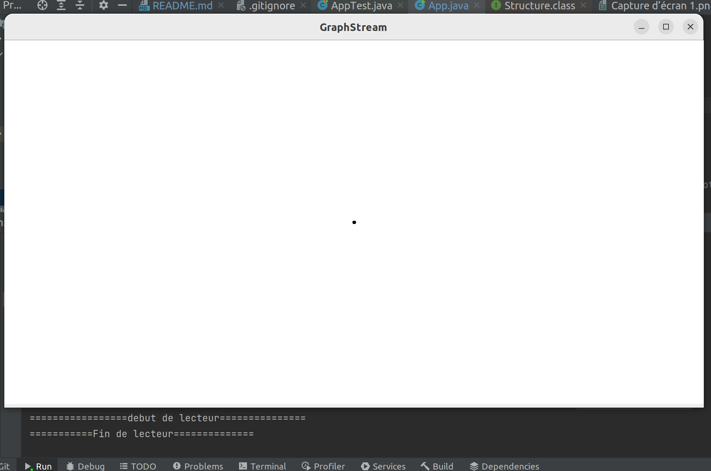
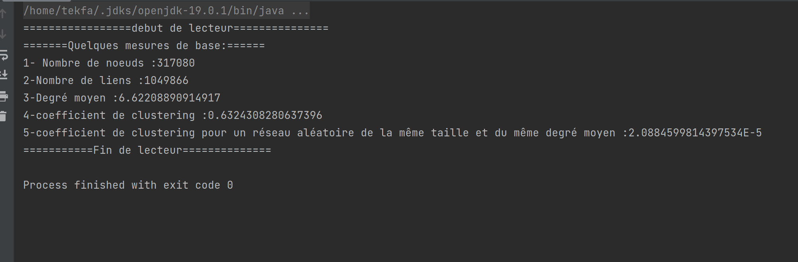
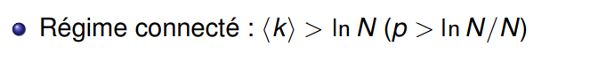
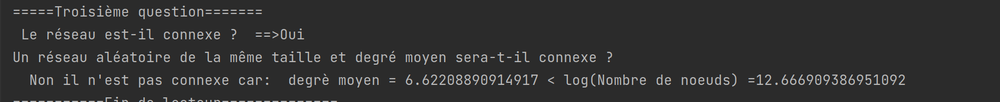

# TP 1 Mesures de réseaux d'interaction
- Fouad TEKFA
- M1 IWOCS
- 2022-2023


Dans ce TP il nous est demandé analyser un réseau de collaboration scientifique en informatique. Le réseau est extrait de DBLP et disponible sur SNAP.
# 1. Téléchargement et lecture de données avec GraphStream:
Pour commencer j'ai tout d'abord téléchargé le fichier contenant la structure de notre réseau de DBLP qui es disponible sur [SNAP](https://snap.stanford.edu/data/com-DBLP.html),
puis pour les lire j'ai utilisé la classe [FileSourceEdge()](https://data.graphstream-project.org/api/gs-core/current/org/graphstream/stream/file/FileSourceEdge.html) de GraphStream en regardant la [Documentation](https://graphstream-project.org/doc/Tutorials/Reading-files-using-FileSource/) voici le pseudo code utilisé
```java
try {
        fs.readAll(filePath);
        System.out.println("debut de lecteur");
        } catch( IOException e) {
        e.printStackTrace();
        }finally {
        fs.removeSink(g);
        System.out.println("Fin de lecteur");
        }
```  
j'ai quand même essayé de visualiser le graphe qui était trop long a visualisé pour cette parti voici donc un capteur des résultats obtenu

# 2. Les Mesures de base du réseau:
## 2.1. Nombre de noeuds:
pour calculer ne nombre totale de noeuds j'ai utilisé getNodeCount() qui nous retourne le nombre de noeud du notre graphe

## 2.2. Nombre de liens:
Pour calculer le nombre de liens j'ai utilisé la fonction getEdgeCount() qui retourne le nombre d'arêtes du notre graphe   
2.3. Degré moyen :
Pour calculer le degré moyen j'ai utilisé la fonction averageDegree après avoir importe la classe Toolkit
```java
import org.graphstream.algorithm.Toolkit;

```
## 2.4. coefficient de clustering:
j'ai utilisé verageClusteringCoefficient de la classe Toolkit qui nous retourne le coefficient de clustering de notre graphe passer en paramètre
## 2.5. Coefficient de clustering pour un reseau aleatoire :
pour calculer coefficient de clustering pour un réseau aléatoire de la même taille et du même degré moyen donc j'ai calculé (Degré_moyen)/(Nombre_de_noeuds)
## 2.6. Résultats obtenue:

# 3. Troisième question
## 3.1. Le réseau est-il connexe ?
Un réseau est connexe si seulement si s'il est possible, à partir de n'importe quel noeud, de rejoindre les autres noeud et pour vérifier cela j'ai utilisé la méthode isConnected de la classe Toolkit qui qui m'a retourné vrai donc le réseau est connexe
```java
System.out.println(" Le réseau est-il connexe ?  ==>"+((Toolkit.isConnected(g)? "Oui" : "Non ")));
```
## 3.2 Un réseau aléatoire de la même taille et degré moyen sera-t-il connexe ?
Comme on a vu en cours :




Non il n'est pas connexe car : le degré moyen <K> = 6.62208890914917 < ln(N) =12.666909386951092
## 3.3. À partir de quel degré moyen un réseau aléatoire avec cette taille devient connexe ?
Il faudra que le degré moyen sera supérieur à ln(N)=12.666909386951092
## 3.4. Résultats obtenue:


# Quatrième question

## 4.1. Calcule de la distribution des degrés
La distribution de degrés $`p_k = \frac{N_k}{N}`$ est la probabilité qu'un nœud choisi au hasard ait degré $`k`$. On peut utiliser [`Toolkit.degreeDistribution()`]

Afin de pouvoir tracer avec gnuplot j'ai généré un [fichier](./src/resources/dd_dblp.dat) Contenant la distribution des degrés en utilisant le script suivant :
```java
   int[] dd = Toolkit.degreeDistribution(g);
        for (int k = 0; k < dd.length; k++) {
        if (dd[k] != 0) {
        bw.write(String.format(Locale.US, "%6d%20.8f%n", k, (double)dd[k] / g.getNodeCount()));
        }
```

## 4.2. En échelle linéaire :
On utilise ce [script](/src/resources/lineaire.gnu) pour tracer la distribution en échelle linéaire.


## 4.2. En échelle Log Log:
On utilise ce [script](/src/resources/ehelle_log_log.gnu) pour tracer la distribution en échelle Log Log.


En traçant la distribution de degrés en échelle log-log on observe une ligne droite pendant plusieurs ordres de grandeur. Cela nous indique une loi de puissance :

```math   
p_k = C k^{-\gamma}
```
## 4.3. La distribution de Poisson avec la même moyenne pour comparaison :
On utilise ce [script](/src/resources/La_distribution_de_Poisson_avec_la_meme%20moyenne.gnu) pour tracer La distribution de Poisson avec la même moyenne :


## 4.4. Tracer la distribution de Poisson avec la même moyenne
On utilise ce [script](/src/resources/plot_dd.gnu) pour tracer la distribution et estimer l'exposant de la loi de puissance.
    
