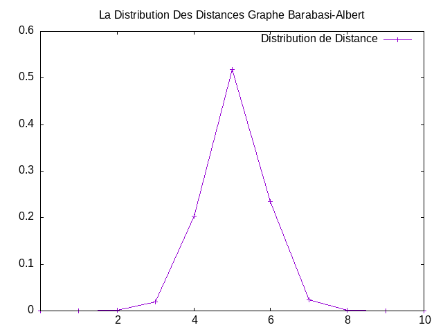
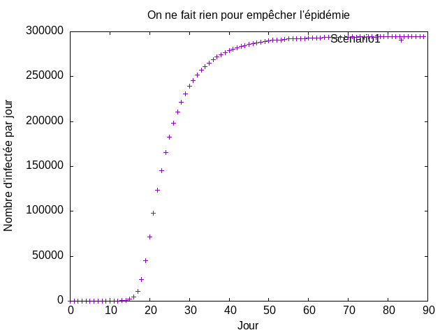
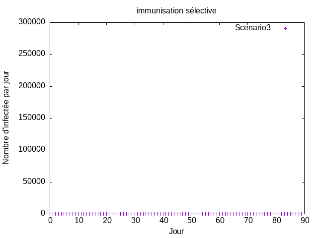

# TP 2 Mesures de réseaux d'interaction
- Fouad TEKFA
- M1 IWOCS
- 2022-2023


Je vous présente mes excuses pour le retard de rendu de TP2 , vu que j'ai était malade . Vous pouvez trouver mon certificat d'arrêt maladie dans mon dépôt Git.

Dans ce TP il nous est demandé analyser un réseau de collaboration scientifique en informatique. Le réseau est extrait de DBLP et disponible sur SNAP.
# 1. Téléchargement et lecture de données avec GraphStream:
Pour commencer j'ai tout d'abord téléchargé le fichier contenant la structure de notre réseau de DBLP qui es disponible sur [SNAP](https://snap.stanford.edu/data/com-DBLP.html),
puis pour les lire j'ai utilisé la classe [FileSourceEdge()](https://data.graphstream-project.org/api/gs-core/current/org/graphstream/stream/file/FileSourceEdge.html) de GraphStream en regardant la [Documentation](https://graphstream-project.org/doc/Tutorials/Reading-files-using-FileSource/) voici le pseudo code utilisé
```java
try {
        fs.readAll(filePath);
        System.out.println("debut de lecteur");
        } catch( IOException e) {
        e.printStackTrace();
        }finally {
        fs.removeSink(g);
        System.out.println("Fin de lecteur");
        }
```  
j'ai quand même essayé de visualiser le graphe qui était trop long a visualisé pour cette parti voici donc un capteur des résultats obtenu

# 2. Les Mesures de base du réseau:
## 2.1. Nombre de noeuds:
pour calculer ne nombre totale de noeuds j'ai utilisé getNodeCount() qui nous retourne le nombre de noeud du notre graphe

## 2.2. Nombre de liens:
Pour calculer le nombre de liens j'ai utilisé la fonction getEdgeCount() qui retourne le nombre d'arêtes du notre graphe   
2.3. Degré moyen :
Pour calculer le degré moyen j'ai utilisé la fonction averageDegree après avoir importe la classe Toolkit
```java
import org.graphstream.algorithm.Toolkit;

```
## 2.4. coefficient de clustering:
j'ai utilisé verageClusteringCoefficient de la classe Toolkit qui nous retourne le coefficient de clustering de notre graphe passer en paramètre
## 2.5. Coefficient de clustering pour un reseau aleatoire :
pour calculer coefficient de clustering pour un réseau aléatoire de la même taille et du même degré moyen donc j'ai calculé (Degré_moyen)/(Nombre_de_noeuds)
## 2.6. Résultats obtenue:

# 3. Troisième question
## 3.1. Le réseau est-il connexe ?
Un réseau est connexe si seulement si s'il est possible, à partir de n'importe quel noeud, de rejoindre les autres noeud et pour vérifier cela j'ai utilisé la méthode isConnected de la classe Toolkit qui qui m'a retourné vrai donc le réseau est connexe
```java
System.out.println(" Le réseau est-il connexe ?  ==>"+((Toolkit.isConnected(g)? "Oui" : "Non ")));
```
## 3.2 Un réseau aléatoire de la même taille et degré moyen sera-t-il connexe ?
Comme on a vu en cours :


Non il n'est pas connexe car : le degré moyen <K> = 6.62208890914917 < ln(N) =12.666909386951092
## 3.3. À partir de quel degré moyen un réseau aléatoire avec cette taille devient connexe ?
Il faudra que le degré moyen sera supérieur à ln(N)=12.666909386951092
## 3.4. Résultats obtenue:


# Quatrième question

## 4.1. Calcule de la distribution des degrés
La distribution de degrés $`p_k = \frac{N_k}{N}`$ est la probabilité qu'un nœud choisi au hasard ait degré $`k`$. On peut utiliser [`Toolkit.degreeDistribution()`]

Afin de pouvoir tracer avec gnuplot j'ai généré un [fichier](./src/resources/dd_dblp.dat) Contenant la distribution des degrés en utilisant le script suivant :
```java
   int[] dd = Toolkit.degreeDistribution(g);
        for (int k = 0; k < dd.length; k++) {
        if (dd[k] != 0) {
        bw.write(String.format(Locale.US, "%6d%20.8f%n", k, (double)dd[k] / g.getNodeCount()));
        }
```

## 4.2. En échelle linéaire :
On utilise ce [script](/src/resources/lineaire.gnu) pour tracer la distribution en échelle linéaire.


## 4.2. En échelle Log Log:
On utilise ce [script](/src/resources/ehelle_log_log.gnu) pour tracer la distribution en échelle Log Log.


En traçant la distribution de degrés en échelle log-log on observe une ligne droite pendant plusieurs ordres de grandeur. Cela nous indique une loi de puissance :

```math   
p_k = C k^{-\gamma}
```
## 4.3. La distribution de Poisson avec la même moyenne pour comparaison :
On utilise ce [script](/src/resources/La_distribution_de_Poisson_avec_la_meme_moyenne.gnu) pour tracer La distribution de Poisson avec la même moyenne :


## 4.4. Tracer la distribution de Poisson avec la même moyenne
On utilise ce [script](/src/resources/plot_dd.gnu) pour tracer la distribution et estimer l'exposant de la loi de puissance.
    

# Cinquième question :
Maintenant on va calculer la distance moyenne dans le réseau. Le calcul des plus courts chemins entre 
toutes les paires de nœuds prendra plusieurs heures pour cette taille de réseau. C'est pourquoi on va 
estimer la distance moyenne par échantillonnage en faisant un parcours en largeur à partir de 1000 sommets 
choisis au hasard. L'hypothèse des six degrés de séparation se confirme-t-elle ? Est-ce qu'il s'agit d'un 
réseau petit monde ? Quelle sera la distance moyenne dans un réseau aléatoire avec les mêmes caractéristiques ? 
Tracez également la distribution des distances. Formulez une hypothèse sur la loi de cette distribution.
 ## 5.1. Calcule de la distance moyenne dans ce réseau :
Pour estimer la distance moyenne par échantillonnage, j'ai suivi les étapes suivantes :
- J'ai utilisé la méthode randomNodeSet de la classe Toolkit pour avoir les 1000 sommets au hasard.  
- J'ai utilisé l'algorithme de parcours en largeur BFI pour avoir la longueur du plus court chemin entre deux nœuds.
- J'ai calculé la somme des distances d'un nœud (le nœud source) vers tous les autres nœuds de l'échantillon.
- j'ai divisé la somme obtenue par le nombre de nœuds * 1000 pour obtenir une estimation de la distance moyenne de notre réseau.
### Voici les résultats obtenus:
    la somme = 2.175195856E9
    Max = 3.1708E8
    Distance Moyenne = 6.860085328623692

## 5.2. L'hypothèse des six degrés: 
Oui, l'hypothèse des six degrés de séparation se confirme vu que la Distance Moyenne = 6.860085328623692.
## 5.3. Petit Monde: 
Comme on a vu en cours la propriété petit monde est définie par : 


Oui, il s'agit d'un réseau petit monde, car Distance moyenne ≈ ln(N)/ln(k)

## 5.4.La distance moyenne dans un réseau aléatoire avec les mêmes caractéristiques:
D'après le cours Un réseau aléatoire avec les mêmes caractéristiques aura une distance moyenne similaire.

## 5.5. La distribution des distances
J'ai créé la méthode sauvegardeDistributionDistance(int NodeCount, List<Node> randomnode  ) afin de calcule la distribution de la distance puis generer le fichiers DistributionDistance.data.  
 
pour tracer la distribution des distances avec le [fichier](/src/resources/DistributionDistance.data) généré, j'ai utilisé ce [script](/src/resources/DistributionDistance.gnuplot) : 
   

  
## 5.6. Hypothèse sur la loi de cette distribution :
- La distribution de distances de ce réseaux suit un loi de Poisson.

# Sixième question :
Utilisez les générateurs de GraphStream pour générer un réseau aléatoire et un réseau avec la méthode d'attachement préférentiel
(Barabasi-Albert) qui ont la même taille et le même degré moyen.
Refaites les mesures des questions précédentes pour ces deux réseaux. 
Les résultats expérimentaux correspondent-ils aux prédictions théoriques ? 
Comparez avec le réseau de collaboration. Que peut-on conclure ?
## 6.1 générer un réseau aléatoire 
- generateurRandom(double nbNoeuds , double degreeMoyen) : cette méthode et pour but de générer un réseau aléatoire, elle prend deux paramètres nombre de Nœuds et le dégrée Moyen, en utilisant la classe RandomGenerator de graphStream.     
## 6.2 générer un réseau avec la méthode d'attachement préférentiel (Barabasi-Albert) :
- generateurBarabasiAlbert(int nbNoeuds ,int degreeMoyen) : cette méthode et pour but de générer un réseau Barabasi-Albert , elle prend deux paramètres nombre de Nœuds et le dégrée Moyen, en utilisant la classe Barabasi-Albert de graphStream. 
## 6.3.Refaire les mesures des questions précédentes pour ces deux réseaux : 

| type de graphe | Nombre de noeuds | Nombre de liens    | Degré moyen      | coefficient de clustering    | connexe | Distance Moyenne                                                                                       |
|-------------|------------------|-----|------------------|-----|---------|--------------------------------------------------------------------------------------------------------|
| DBLP            |  317080          | 1049866    |   6.62208890914917  |   2.0884599814397534E-5  | oui     |6.860085328623692 |  
| RandomGraph | 317080           |  1049503   | 6.19799613952637 |  1.8928034176551887E-5   | Non     |          6.912789999369244                                                                                              |
| Barabàsi-Albert | 317080           | 1109288    | 6.99689674377441 | 3.8303829341658014E-4    | Oui     |      5.062236192758925                                                                                                  |

### distribution des degrés (RandomGraph ):  
On utilise ce [script](src/resources/dd_dblp_Random.gnuplot) pour tracer la distribution et estimer l'exposant de la loi de puissance. 

   

### distribution des degrés (Barabàsi-Albert ):
On utilise ce [script](src/resources/dd_dblp_B_A.gnuplot) pour tracer la distribution et estimer l'exposant de la loi de puissance

   

###  La distribution des distances (RandomGraph ):

###  La distribution des distances (Barabàsi-Albert ):
 

## 6.4. Les résultats expérimentaux et théoriques: 
Les résultats sont preceque similaires entre les meseures théorique et pratique.

Sauf que remarque que le cooefficient de clustering du réseau arabàsi-Albert est plus élévé par rapport au
collaborateur et au réseau aléatoire. 

La distribution de distances des trois réseaux suit un loi de Poisson .
et L'hypothèse des six degrés de séparation se confirme sûr les trois réseau.

# TP 3 Propagation

Nos collaborateurs scientifiques communiquent souvent par mail. Malheureusement pour eux, les pièces jointes de ces mails contiennent parfois des virus informatiques. On va étudier la propagation d'un virus avec les hypothèses suivantes :

- Un individu envoie en moyenne un mail par semaine à chacun de ses collaborateurs.
- Un individu met à jour son anti-virus en moyenne deux fois par mois. Cela nettoie son système mais ne le protège pas de nouvelles infections car le virus mute.
L'épidémie commence avec un individu infecté (patient zéro).
## 1.  :  
Quel est le taux de propagation du virus ? Quel est le seuil épidémique du réseau ? Comparez avec le seuil théorique d'un réseau aléatoire du même degré moyen.
### 1.1. Taux de propagation du virus :
Pour prédire si la maladie persiste, on définit le taux de
propagation λ par  :
```math               
λ = β / µ
``` 
- β est la probabilité de transmettre dans une unité de temps dans notre cas :
```math
β = 1/7   
```
avec t = 1 jour 
- μ est le taux de guérison dans notre cas:
```math                                       
β = 1 / 14                   
```   
avec t = 1 mois
Donc :
```math                                       
λ = β/µ = 14/7= 2                      
```               

### 1.2 Seuil épidémique : 
```math
λ_c = 〈k〉/〈k2〉≈0.045984724362225844 ≈ 0,046 
```


### 1.3 le seuil théorique d'un réseau aléatoire du même degré moyen :
```math
 λ_c = 1/{<K>+1} ≈ 0.13119762993051035 ≈0.131 
```
### 1.4.Résultats obtenue: 


### 2. Simulation de la propagation du virus selon le scénario:
Simulez la propagation du virus jour par jour pendant trois mois avec les scénarios suivants :

On ne fait rien pour empêcher l'épidémie
On réussit à convaincre 50 % des individus de mettre à jour en permanence leur anti-virus (immunisation aléatoire)
On réussit à convaincre 50 % des individus de convaincre un de leurs contacts de mettre à jour en permanence son anti-virus (immunisation sélective).
Pour chacun des trois scénarios, tracez l'évolution de la fraction d'infectés de la population non immunisée. Que peut-on conclure ?
### 2.1. Scénario 1 :
Dans ce scénario, on choisit aléatoirement un individu pour être le patient zéro que serra infectée et on ne fait rien pour empêcher la transmutation du virus donc on va travailler qu'en fonction β( la probabilité de transmettre dans une unité de temps) et Mu (taux de guérison)
Pour se là,j'ai créé la méthode SimulationScenario1 (Graph g , String nom_fichiers) qui prend un graphe (notre réseau) et nom de fichiers a généré en utilisant la méthode savtab ( String name, long [] tab) afin de sauvegarder le tableau dans un fichier 

Voici la courbe de premier scénario 1 :



### 2.1. Scénario 2 :
Dans ce scénario, on réussit à convaincre 50 % des individus de mettre à jour en permanence leur anti-virus (immunisation aléatoire) puis on a aussi les deux paramètre à prendre en compte β( la probabilité de transmettre dans une unité de temps) et Mu (taux de guérison) es choisir un nœud au hasard pour l'infecter qui serra le patient zéro à condition qu'il n'est pas déjà immunisé.
Pour se là,j'ai créé la méthode SimulationScenario2 (Graph g , String nom_fichiers) qui prend un graphe (notre réseau) et nom de fichiers a généré en utilisant la méthode savtab ( String name, long [] tab) afin de sauvegarder le tableau dans un fichier

Voici la courbe de deuxième scénario:


### 2.1. Scénario 3 :
On réussit à convaincre 50 % des individus de convaincre un de leurs contacts de mettre à jour en permanence son anti-virus (immunisation sélective).puis on a aussi les deux paramètre à prendre en compte β( la probabilité de transmettre dans une unité de temps) et Mu (taux de guérison) es choisir un nœud au hasard pour l'infecter qui serra le patient zéro à condition qu'il n'est pas déjà immunisé.
Pour se là,j'ai créé la méthode SimulationScenario3 (Graph g , String nom_fichiers) qui prend un graphe (notre réseau) et nom de fichiers a généré en utilisant la méthode savtab ( String name, long [] tab) afin de sauvegarder le tableau dans un fichier




<strong> D'après les trois courbes différentes de chaque Scenario,on ne peut conclure que l'immunisation 
sélective et efficace par rapport à l'immunisation alèatoire </strong>

## 3. calculer de degré moyen des groupes 0 et 1: 


D'après les résultats, on remarque que le degré moyen du groupe0≈ 6.613611706824776 qui 
est similaire au degré moyen de notre réseau, contrairement au degré moyen du groupe1≈11.360944594036832 qui est presque le double.

Donc on peut dire qu'il y a une présence plus élevée des hubs dans le groupe 1, ce qui s'explique par rapport à la sélection 
des noeuds dans ce groupe, qui ait pour but d'avoir plus de chance de tomber sur un "hub", étant donné que nous sélectionnons 
un noeud aléatoirement puis son voisin aléatoirement ce qu'augumante notre chance de tomber sûr un hub.


## 4. seuil épidémique de Scénario 2 et 3:

Pour calculer le seuil épidémique de Scénario 2 et 3, j'ai commencé par créer une liste et puis ajouter les 
noeuds du graphe, je parcours ensuite la liste et si je trouve un noeud immunisé, 
je l'enlève de la liste. Finalement, je calcule le seuil en utilisant la formule <k> / <k²> des noeuds restants dans la liste (les noeuds non immunisée).

Voici les résultats obtenus:  


Le seuil épidémique de l'immunisation aléatoire est approximativement égal au seuil épidémique du réseau initial
et le seuil épidémique de la stratégie d'immunisation sélective est plus élevé environ deux fois plus grand
vu que dans le Scénario 3 (immunisation sélective) on retire un grand nombre de hubs du notre réseau ,ce qui limite la propagation du virus.


## 5. Simulation de l'épidémie dans un réseau aléatoire et un réseau généré avec la méthode d'attachement préférentiel:

### 5.1. Simulation de l'épidémie dans un réseau aléatoire:


### 5.2. Simulation dans un réseau généré avec la méthode d'attachement préférentiel:


### 5.3. Comparaison et analyse des résultats : 
Scénario 1
Les trois réseaux(initiale, randome et Barabasi-Albert) finissent presque à la même valeur mais cette valeur est atteinte plus
rapidement dans le graphe généré avec la méthode d'attachement préférentiel (Barabasi-Albert).

Scénario 2

Les réseaux random et Barabasi-Albert se stabilisent à des valeurs similaires, tandis que 
le réseau initial se stabilise à une valeur légèrement inférieure sauf que ses valeurs s'atteinte plus
rapidement dans le graphe généré avec la méthode d'attachement préférentiel (Barabasi-Albert).

Scénario 3 

Même avec une stratégie d'immunisation sélective, les réseaux aléatoire et Barabasi-Albert se stabilisent à des valeurs similaires 
au Scénario2 sauf que ses valeurs s'atteinte plus rapidement dans le Scénario2, contrairement au réseau initiale.

Ses valeurs s'atteinte plus rapidement dans le graphe généré avec la méthode d'attachement préférentiel. 

## conclusion

On peut en conclure que la stratégie d'immunisation sélective reste avantageuse dans tous les cas.


